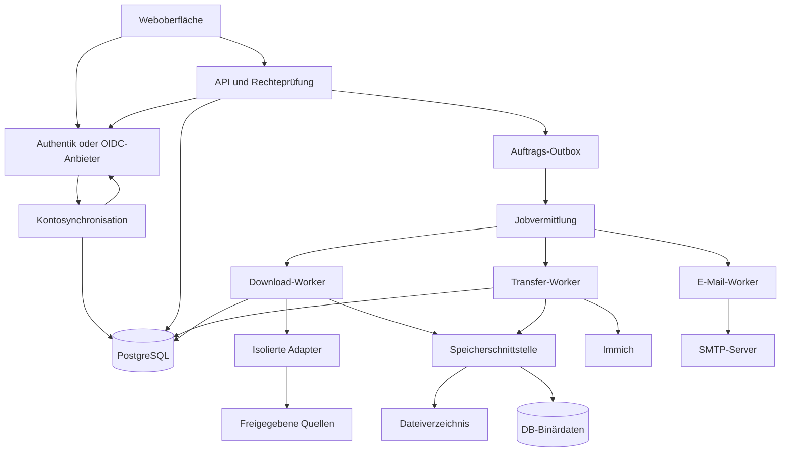

# 02 – Architektur und Technologieentscheidungen

## 1. Aufbau

Empfohlen wird ein modularer Monolith mit separat gestarteten Worker-Prozessen aus demselben Repository. Geschäftsregeln, Datenmodell und Verträge werden geteilt; unzuverlässige Downloader laufen außerhalb des API-Prozesses. Das vereinfacht die erste Installation und erlaubt später eine unabhängige Skalierung.



Outbox, Queue und Katalog sind logisch verschiedene Bereiche derselben PostgreSQL-Installation. Das Diagramm beschreibt keine Pflicht zu zusätzlichen Servern.

## 2. Technologievorschlag

| Aufgabe | Auswahl | Begründung |
| --- | --- | --- |
| Laufzeit | Unterstützte Node.js-LTS-Version, exakt festgelegt | Auf den drei Betriebssystemen nutzbar; gute Streaming-Unterstützung |
| Sprache | TypeScript | Gemeinsame Verträge zwischen Backend, Workern und UI |
| Oberfläche | React | MIT-lizenzierte Basis; statisch ausgeliefertes Frontend |
| HTTP-API | Fastify | Schema-Validierung und überschaubare modulare Struktur |
| Datenbank | PostgreSQL | Katalog, Transaktionen, Queue und optional Binärdaten in einem System |
| DB-Zugriff | node-postgres und Kysely | Explizite Abfragen, typisierte Verträge und Migrationen |
| Queue | pg-boss | Persistente Aufträge ohne zusätzliches Queue-System |
| Terminberechnung | cron-parser plus eigene dokumentierte Zeitregeln | Zeitzonen und deterministisch gespeicherte Ausführungstermine |
| SSO | openid-client im Backend, Authentik als Referenz-IdP | Standardprotokoll statt anbieterspezifischer Anmeldung |
| Lokale Passwörter | node-argon2, Argon2id | Nur für ausdrücklich lokale Konten; SSO-Nutzer haben hier kein Passwort |
| SMTP | Nodemailer | Erprobter SMTP-Client; genaue Lizenz ist MIT-0 |
| Windows-Dienst | WinSW | MIT-lizenzierter Wrapper, der den Node-Prozess als Dienst startet |
| Kryptografie | Node-Standardbibliothek | Zufallswerte, SHA-256 und authentisierte Verschlüsselung |
| Downloader | Eigene Adapter; optionale externe Prozesse | Anbieterlogik austauschbar; Lizenzen separat bewerten |

Diese Auswahl ist kein Nachweis, dass jede transitive Abhängigkeit MIT ist. TypeScript, PostgreSQL und diverse Laufzeitbestandteile haben ausdrücklich andere Lizenzen. Alle Quellen und Ausnahmen: [09](09_Lizenzen_und_Quellen.md). pg-boss dokumentiert persistente PostgreSQL-Jobs und Transaktionsanbindung; daraus folgt keine genau-einmalige Ausführung externer Uploads. Quelle: [pg-boss](https://github.com/timgit/pg-boss).

## 3. Module und Grenzen

| Modul | Verantwortung | Darf nicht |
| --- | --- | --- |
| Identity | Lokale Benutzer-IDs, OIDC-Verknüpfungen, Rechte und Sitzungen; Passwortfunktionen nur im lokalen Modus | IdP-Passwörter speichern oder SSO-Credentials an Downloadseiten weitergeben |
| Lifecycle | SCIM, Anbieterstatus, Sperrgenerationen und kontrollierte Reaktivierung | E-Mail als Kontoschlüssel verwenden oder aus Logout eine Kontolöschung ableiten |
| Sources | Quellkonten, Abonnements, Adapterfähigkeiten | Fremde Quellkonten freigeben |
| Catalog | Creator, Posts, Revisionen, Assets, virtuelle Pfade | Erfolgreichen Transfer aus bloßem HTTP-Status ableiten |
| Jobs | Zeitpläne, Läufe, Versuche, Abbruch, Quoten | Ungeprüfte Shell-Kommandos akzeptieren |
| Storage | Schreiben, Lesen, Prüfen, Entfernen, Migration | History per Cascade löschen |
| Transfers | Immich-Ziele, Uploadbelege, Prüfung | Lokale Nutzdaten direkt nach Upload-Antwort löschen |
| History | Fachliche Ereignisse und Abfragen | Cookies oder API-Schlüssel speichern |
| Notifications | Präferenzen, Vorlagen, Mail-Outbox | Erfolg eines Downloads an SMTP-Verfügbarkeit koppeln |
| Administration | Speicherpolitik, erlaubte Ziele, Betriebszustand | Benutzerpräferenzen stillschweigend übergehen |

## 4. Prozessrollen

- **API:** Authentifizierung, Einstellungen, Bibliothek, Download von vorhandenen Medien und Server-Sent Events für Fortschritt. Keine lang laufenden Extraktionen im HTTP-Request.
- **Scheduler/Dispatcher:** Erzeugt fällige logische Läufe und vermittelt dauerhafte Outbox-Einträge in die Queue.
- **Download-Worker:** Reserviert Quoten, steuert Adapter, streamt Bytes und finalisiert Assets.
- **Transfer-/Cleanup-Worker:** Liest gespeicherte Originale, lädt nach Immich, prüft sie und bearbeitet freigegebene Bereinigungen.
- **Lifecycle-Worker:** Gleicht externe Kontostati unabhängig von Downloadlast regelmäßig ab; verarbeitet Sperren mit eigener Priorität und Kapazität.
- **E-Mail-Worker:** Verarbeitet Reset- und Benachrichtigungsmails mit getrennten Prioritäten.
- **Adapterprozess:** Erhält nur auftragsbezogene Geheimnisse, ein Arbeitsverzeichnis und eingeschränkten Netzwerkzugang. Keine Katalog-/DB-Zugangsdaten.

Der vertrauenswürdige Download-Worker startet den externen **Fetch-Runner** über eine jobgebundene Schnittstelle. Native Variante: geschützte Unix-Socket-Verbindung bzw. Named Pipe mit Betriebssystem-ACL; Linux-Container-Variante: separater eingeschränkter Runner. Ergebnis sind ein begrenztes Manifest und abgeschlossene Staging-Dateien. Der Importer kontrolliert diese erneut. Direkte HTTP-Adapter können stattdessen einen begrenzten Stream liefern. Der Runner erhält niemals Zugang zum Datenbank-Jobpool oder zum globalen Secret-Store.

| Rolle | Erlaubter Zugriff |
| --- | --- |
| API | Katalog/Queue und administrativ freigegebene OIDC-Endpunkte; lokale Medien nur autorisiert |
| Scheduler | Datenbank, fachliche Status-/Sperrprüfung |
| Lifecycle-Worker | Identity-Tabellen und ausdrücklich erlaubte lesende IdP-Statusendpunkte; keine Quellkonten/Medien |
| Fetch-Runner | Erlaubte öffentliche Quellen und eigener Staging-Bereich; kein LAN-/DB-/IdP-Zugriff |
| Ingest/Download-Worker | Eigene Auftragsdaten, Staging-Übernahme, Katalog und Zielspeicher |
| Transfer-Worker | Katalog, Originalspeicher und freigegebene Immich-Ziele |
| Mail-Worker | Benachrichtigungs-/Token-Outbox und freigegebener SMTP-Server |

Authentik und andere IdPs werden unabhängig installiert und versioniert. Ihre Datenbanken, Schlüssel und Administrationsoberflächen werden nicht mit dem Downloader-Schema verschmolzen. Der OIDC-Protokollweg verwendet die normalen OIDC-Endpunkte. Der getrennte verpflichtende Lifecycle-Connector benötigt zusätzlich minimal berechtigte lesende Status-API-Zugriffe. Die konkrete Rolle `hoard-core` aus Quelle B wird hier fachlich in Ingest, Transfer und Mail getrennt, kann aber für kleine Installationen in einem vertrauenswürdigen Dienst zusammengefasst werden.

Im kleinen Betrieb können Dispatcher, Transfer- und Mail-Worker ein gemeinsamer vertrauenswürdiger Prozess sein. Der Prozess für externe Downloader bleibt getrennt. Ein Kindprozess allein ist keine Sandbox: Vor öffentlichem Betrieb müssen die Betriebssystem- und Netzwerkgrenzen aus 06/10 wirken.

## 5. Transaktionen und zuverlässige Nebenwirkungen

1. Die API legt den fachlichen Auftrag und einen Outbox-Eintrag in **derselben Datenbanktransaktion** an.
2. Der Dispatcher sendet die Outbox an pg-boss. Ein Absturz nach dem Senden kann eine zweite Vermittlung verursachen.
3. Worker beanspruchen deshalb zusätzlich den fachlichen Auftrag anhand einer stabilen ID und einer zeitlich begrenzten Lease.
4. Jeder neue Besitzer erhält eine monoton steigende `lease_generation`. Zustandsänderungen verlangen diese Generation; ein alter Worker darf keine späteren Ergebnisse überschreiben.
5. Netzwerkaktionen sind wiederholbar. Vor erneutem Immich-Upload wird ein möglicherweise bereits angelegtes Asset abgeglichen.
6. History-Ereignis und finaler Fachzustand werden gemeinsam committed. Erst anschließend gilt der Auftrag als fachlich abgeschlossen.

Queue-Bestätigung und Fachzustand können auseinanderfallen. Daher ist die Anwendung auf mindestens-einmalige Zustellung mit idempotenter Verarbeitung ausgelegt. Für Immich und Dateisystem existiert keine gemeinsame ACID-Transaktion mit PostgreSQL; Intent, Beleg und Wiederabgleich ersetzen diese nicht vorhandene Transaktion.

## 6. Verträge

Geplante interne Schnittstellen, noch kein ausführbarer Code:

```typescript
interface StorageBackend {
  beginWrite(context: WriteContext): Promise<WriteSession>;
  append(session: WriteSession, chunk: Uint8Array): Promise<void>;
  finalize(session: WriteSession, digest: Digest): Promise<StoredObject>;
  openRead(object: ObjectRef, range?: ByteRange): AsyncIterable<Uint8Array>;
  stat(object: ObjectRef): Promise<ObjectStat>;
  remove(object: ObjectRef, permit: DeletionPermit): Promise<RemovalResult>;
  abort(session: WriteSession): Promise<void>;
}
```

`DeletionPermit` ist eine serverseitig erzeugte, persistierte Bereinigungs-ID mit festem Benutzer, Objekt, Generation, Policy und Prüfbeleg. Ein vom Browser übermitteltes Wahrheitsfeld reicht nicht. Der Storage-Adapter führt ausschließlich bereits autorisierte Operationen aus; die Freigabelogik liegt im Cleanup-Modul.

## 7. Entscheidungen und verworfene Alternativen

| Entscheidung | Gewählt | Grund / Nachteil |
| --- | --- | --- |
| Modularer Monolith vs. Microservices | Modularer Monolith | Einfache Auslieferung; Prozessgrenzen trotzdem möglich |
| PostgreSQL vs. eingebettete Einzeldatei-DB | PostgreSQL | Mehrbenutzerbetrieb und Binärspeicher; Installation benötigt DB-Dienst |
| Filesystem vs. DB als Standard | Filesystem | Einfachere Medienbackups und Betriebskosten; DB bleibt vollständige Option |
| Binärdaten in einem Feld vs. Chunks | Chunks | Größenunabhängiger Transfer; mehr Zeilen und Verwaltungslogik |
| In-Prozess-Plugins vs. Adapterprozesse | Adapterprozesse | Bessere Begrenzung von Fehlern und Rechten; zusätzlicher Prozessaufwand |
| Immich-CLI vs. eigener HTTP-Client | Eigener schmaler HTTP-Client | Kontrolle über Belege, Benutzerzuordnung und DB-Streams |
| Automatische externe Tool-Updates | Kontrollierte Updates | Reproduzierbare Fehleranalyse; schneller Adapter-Releaseprozess nötig |
| Python/FastAPI/Vue vs. Node/Fastify/React | Node/Fastify/React | Gemeinsame Verträge und vorhandene Queue; externe Python-Engines benötigen keinen Python-Webserver |
| Anmeldung selbst bauen vs. IdP nutzen | OIDC als reguläres Profil ab M1 | Passwort-/MFA-Pflege zentralisierbar; lokales Profil für Installationen ohne IdP |
| Anonyme Proxy-Header vs. OIDC | OIDC im Backend | Identität wird kryptografisch geprüft; ein frei gesetztes Benutzerheader ist kein Login |

Die Entscheidung für Node ist ein Projektvorschlag, kein allgemeines Qualitätsurteil über Python. Eine zweite parallele Backendimplementierung oder zwei Frontendframeworks würden die Wartung verdoppeln. Detailbegründung und übernommene Stärken beider Entwürfe stehen in [12](12_Entscheidungen_und_Quellenvergleich.md).

## 8. Authentifizierung und fachliche Rechte

Der externe Anbieter beantwortet, wer sich angemeldet hat. Der Downloader entscheidet, auf welche Objekte diese Person zugreifen darf. Die stabile `users.id` bleibt Eigentümer von Quellen, Medien und History. Verknüpfungen nutzen das Paar aus verifiziertem OIDC-Issuer und Subject; E-Mail-Adressen sind kein Identitätsschlüssel.

Gruppen können die Anwendungsrolle steuern. Lokale Sperren, Quoten, deaktivierte Adapter und Speicherpolicies gelten zusätzlich. Eine Sitzung ist nicht die Ausführungserlaubnis eines laufenden Zeitplans: normales Logout stoppt Jobs nicht; eine echte Kontosperre tut dies an sicheren Grenzen. Die automatische Synchronisation externer Kontosperren ist eine verbindliche eigene Funktion mit SCIM und Anbieter-Connectoren. Sie aktualisiert dieselbe zentrale Berechtigungsprüfung für API und Worker; ein OIDC-Login allein erfüllt sie nicht. Maßgeblicher Vertrag: [11](11_SSO_Authentik_und_OIDC.md).

## 9. Versionsstrategie

Immich folgt der **jeweils neuesten stabilen Veröffentlichung**, ohne Vorabversionen. Bei Recherche am 6. Oktober 2026 führte die [offizielle Latest-Seite](https://github.com/immich-app/immich/releases/latest) zu [v3.2.4](https://github.com/immich-app/immich/releases/tag/v3.2.4). In M0 und vor der Produktfreigabe wird diese Referenz erneut geprüft. Die dann ausgewählte Version, ihr API-Vertrag und Artefakt-Hashes werden festgehalten; ein beweglicher `latest`-Tag ersetzt keine getestete Installation.

Adapterversion, Kernversion und Immich-Zielversion werden in jedem Lauf mitgeschrieben. Updates werden zuerst mit Upload, Dublette, Kontoidentität, Originalabruf und Cleanup-Fehlerfällen getestet. Erkennt die App einen ungeprüften Versionswechsel, pausiert automatisches Cleanup bis zum erneuten Nachweis. Unbekannte Versionen gelten nicht allein wegen einer größeren Versionsnummer als kompatibel.

## 10. Last und Betreiberkonfiguration

Auslegung: zunächst ein Benutzer, bis zu 100 Benutzer im Abnahmelastprofil. Die App setzt keine feste Downloadanzahl pro Benutzer und kein hartes Produktlimit auf zwei Streams. Der Admin bestimmt globale und benutzer-/quellbezogene Budgets sowie Worker-Kapazität. Queue und Streaming sorgen für Backpressure; unbegrenzte konfigurierte Benutzerbudgets erzeugen keine unbegrenzte Zahl von Prozessen.

Authentifizierung, Sperrsynchronisation und Sitzungswiderruf besitzen reservierte Kapazität außerhalb des Downloadpools. Eine volle Downloadqueue darf eine IdP-Sperre nicht verzögern. Prozess-, RAM-, Temp- und DB-Grenzen schützen die Konsistenz; sie werden als Ressourcenstatus transparent angezeigt. Die genaue Konfiguration steht in 04 und 10.

