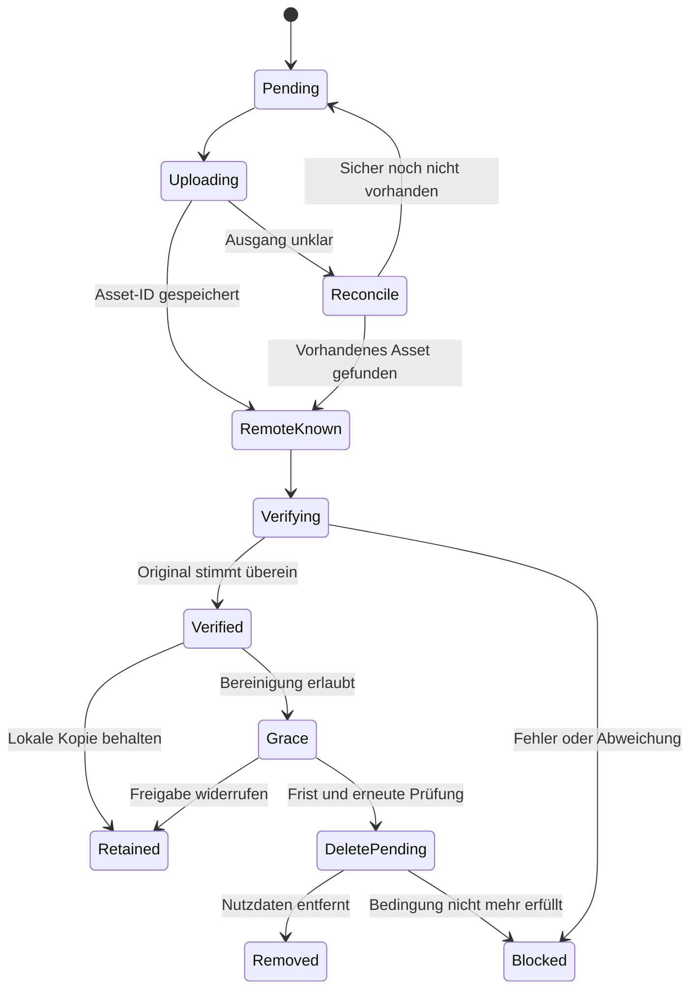

# 05 – Immich-Übertragung, lokale Bereinigung und History

## 1. Verbindliche Sicherheitsregel

Eine lokale Originalkopie darf automatisch entfernt werden, wenn **alle** Bedingungen erfüllt sind:

1. Der Benutzer hat genau für diese Übertragung bzw. eine eindeutig angezeigte Regel das lokale Entfernen aktiviert; die Admin-Policy erlaubt es weiterhin.
2. Es gibt einen persistenten Transferbeleg für Blob, Zielinstanz, Zielkonto und Verbindungsgeneration.
3. Das Ziel enthält eine abrufbare Originaldatei, deren SHA-256 und Bytezahl mit dem lokal archivierten Ergebnis übereinstimmen.
4. Alle erforderlichen Verarbeitungsschritte wie die gewählte Albumzuordnung sind abgeschlossen.
5. Die Karenzzeit ist verstrichen, der Prüfbeleg ist hinreichend aktuell und es bestehen keine konkurrierenden Behaltewünsche, Migrationen oder Leser-Leases.
6. History und Bereinigungsabsicht sind dauerhaft committed, bevor die Nutzdaten angefasst werden.

Ein Vorschaubild, ein Video-Transcode, eine Uploadantwort, ein Dateiname oder ein SHA-1-Dublettenhinweis erfüllt Bedingung 3 nicht. Der lokale SHA-256 bleibt die Integritätsreferenz.

## 2. Verbindung pro Benutzer

Der Benutzer legt ein Immich-Ziel mit Basis-URL und eigenem API-Key an. Private Netzadressen sind nur zulässig, wenn der Admin genau diesen Immich-Endpunkt freigegeben hat. Diese Ausnahme gilt ausschließlich für den Transfer-Worker und nicht für Download-URLs.

SSO zum Downloader erzeugt weder ein Immich-Konto noch einen Immich-API-Key. Auch wenn beide Anwendungen denselben Authentik-Server nutzen, bleiben ihre Zugriffsberechtigungen getrennt. Ein gemeinsamer Immich-Server ist möglich, aber jeder Downloader-Benutzer erhält eine eindeutig geprüfte eigene Kontoverbindung. Eine gemeinsame technische Immich-Identität wird nicht stillschweigend für mehrere Benutzer verwendet.

Beim Verbindungstest werden Erreichbarkeit, Version, Identität des Zielkontos, notwendige Fähigkeiten und Berechtigungen geprüft. Kann die Kontoidentität für die unterstützte Version nicht zuverlässig bestimmt werden, wird die Verbindung nicht für automatisches Löschen freigegeben. API-Key verschlüsselt speichern; UI zeigt nur Name, Status und gegebenenfalls ein unsensibles Suffix.

Die benötigten Fähigkeiten sind Upload, Lesen der Assetinformationen und Abruf der Originaldatei; optional Albumanlage und -zuordnung. **Keine Remote-Löschberechtigung anfordern.** Die konkreten Permission-Namen und Pflichtfelder werden aus dem Schema der ausgewählten Immich-Version übernommen. URL, Konto oder Credential-Zuordnung ändern die `config_generation`; alte Prüfbelege autorisieren kein Löschen für eine neue Generation.

## 3. Technischer Anschluss

Ziel ist jeweils die neueste stabile Immich-Version. Am 6. Oktober 2026 wurde [v3.2.4](https://github.com/immich-app/immich/releases/tag/v3.2.4) über die [offizielle Latest-Seite](https://github.com/immich-app/immich/releases/latest) ermittelt. M0 und Release-Abnahme aktualisieren diese Zielreferenz und halten den getesteten API-Vertrag fest. Ein Versionswechsel sperrt Cleanup bis zur erneuten Kompatibilitätsprüfung; es gibt keine automatische Installation ungeprüfter Releases.

Ein kleiner eigener HTTP-Client kommuniziert mit Immich. Es wird weder auf Immichs Datenbank zugegriffen noch in seine internen Uploadverzeichnisse geschrieben. Originaldaten kommen als Stream aus dem Filesystem- oder DB-Backend.

Die eingesehenen Immich-Controller bieten `uploadAsset`, einen Originalabruf `downloadAsset`, `checkBulkUpload` zur SHA-1-basierten Dublettenprüfung sowie `getAssetInfo`. Upload erfolgt als Multipart; erfolgreiche Neuanlage und vorhandene Dublette werden unterschieden. Quellen: [Asset-Media-Controller](https://github.com/immich-app/immich/blob/main/server/src/controllers/asset-media.controller.ts), [Asset-Controller](https://github.com/immich-app/immich/blob/main/server/src/controllers/asset.controller.ts).

Diese Operationsnamen bilden die Integrationsbasis; URL-Präfixe, DTOs, Antwortfelder, Headerkodierungen und Permission-Strings werden beim M0-Prototyp gegen die tatsächlich eingesetzte Release-Version festgehalten. Ein Link auf den Entwicklungsbranch ist kein stabiler Release-Vertrag. Die Web-API-Referenz war bei der Recherche nur eingeschränkt auslesbar; es wird deshalb kein ungeprüfter vollständiger Request-Body als fertiger Code ausgegeben.

Die Immich-CLI unterstützt ebenfalls Uploads und lokale Löschoptionen. Sie wird hier nicht zur Löschinstanz gemacht: Fachliche History, Datenbankstreams und die strengeren Prüfschritte gehören dem Downloader. Quelle: [Immich CLI](https://docs.immich.app/features/command-line-interface/).

## 4. Ablauf und Zustände

`Blocked` ist ein reparierbarer Zustand mit Fehlergrund, kein erfolgreicher Abschluss. Fachlich werden Transferstatus, lokale Verfügbarkeit und Remote-Prüfstatus getrennt gespeichert. Ein SMTP-Fehler darf diese Zustände nicht verändern.

### A. Vorbereitung

1. Besitzer, Assetversion, Blobhash, Speicher- und Verbindungsgeneration einfrieren.
2. Medientyp anhand des tatsächlichen Inhalts und der getesteten Immich-Fähigkeiten prüfen.
3. Transfer-ID und stabilen Idempotenzschlüssel anlegen: Benutzer + Zielgeneration + Blob-ID.
4. Lokale Lesereferenz erwerben, damit Cleanup und Migration das Original nicht während des Uploads entfernen.

### B. Upload und unklare Antworten

Der Stream wird mit Backpressure und begrenzter Parallelität gesendet. Ein optionaler SHA-1-Wert dient ausschließlich dem Immich-Dublettenprotokoll und wird zusätzlich zum SHA-256 berechnet. Algorithmus und Kodierung sind versioniert; kein blindes Vergleichen unterschiedlicher Hashdarstellungen.

Bei Erfolg bzw. Dublette Asset-ID sofort persistieren. Bei Timeout oder Absturz kann das Asset bereits angelegt sein. Nach Wiederanlauf wird zuerst anhand gespeicherter Transferkennung und der unterstützten Dubletten-/Suchfunktionen abgeglichen. Keine Identifikation allein per Dateiname. Ist der Ausgang nicht sicher auflösbar, bleibt `REMOTE_OUTCOME_UNKNOWN`; die lokale Kopie bleibt erhalten. Immich-Idempotenz wird nicht allein aus einer clientseitigen ID unterstellt.

### C. Prüfung

1. Assetinformationen mit demselben Zielkonto erneut abrufen und Zuordnung prüfen.
2. Sicherstellen, dass das Ziel kein gelöschtes/gesperrtes oder lediglich indirekt eingebundenes Asset ist, soweit die API diese Zustände liefert.
3. **Originaldatei vollständig zurücklesen**, Bytes zählen und SHA-256 streamend berechnen. Kein Thumbnail- oder Playback-Endpunkt.
4. Prüfsumme und Bytezahl mit der lokalen Referenz vergleichen; vollständigen Abruf und sauberes Streamende verlangen.
5. Prüfbeleg, Remote-ID, Serverversion, Prüfzeit, Zielkonto und gewählte Albumzuordnung committen.

Das Rücklesen verursacht zusätzliche Bandbreite, aber keinen vollständigen RAM-Puffer und keine zweite dauerhafte lokale Datei. Für „nur kopieren“ kann die UI einen vorläufigen Uploadstatus zeigen; automatische Löschung benötigt immer die vollständige Originalprüfung.

**Sonderfall externe Immich-Bibliothek:** Ein Immich-Asset, das nur auf dieselben Downloader-Dateien zugreift, ist keine unabhängige Kopie. Solche Übertragungsziele sind für Cleanup ausgeschlossen. Bei einem Dublettenfund muss der Client feststellen können, dass das Original unabhängig gespeichert ist. Sind Herkunft/Unabhängigkeit nicht belegbar, bleibt die Quelle erhalten. Bloßes Einlesen des Downloader-Verzeichnisses durch Immich aktiviert niemals lokales Entfernen.

### D. Karenz und Bereinigung

Vorschlag: 24 Stunden Karenz nach erfolgreicher Prüfung; pro Regel einstellbar. Die Karenz bedeutet zunächst nur verzögertes Entfernen und dupliziert die Datei nicht. Eine längere Papierkorb-Aufbewahrung ist optional und spart bis zu ihrem Ablauf keinen Platz.

Vor endgültiger Entfernung:

- Aktuelle Freigabe, Zielgeneration, Assetzustand, aktive lokale und externe Benutzerberechtigung mit frischem Lifecycle-Status und sämtliche Behalteverweise dieser Kopie prüfen. `authz_generation` muss zur Freigabe passen; eine Kontosperre invalidiert alte Cleanup-Intents.
- Prüfbeleg höchstens 10 Minuten alt; andernfalls den vollständigen Originalabruf wiederholen. Dieser Startwert ist konfigurierbar, die Mindestprüfung nicht abschaltbar.
- Objektgeneration und Hash der unveränderlichen lokalen Kopie abgleichen; unerwartete Änderung blockiert.
- Exklusive Bereinigungsmarkierung unter Blob-/Kopiensperre setzen. Neue Leser, Referenzen und Migrationen müssen dieselbe Sperre beachten und bei `delete_pending` warten oder eine neue Kopie erzeugen.
- `cleanup_intent` und `LOCAL_DELETE_REQUESTED` committen.

Dateisystem: Nur die exakt referenzierte Datei innerhalb des verwalteten Roots entfernen; keine Wildcards und keine rekursiven Verzeichnislöschungen. Danach `copy=removed` und `LOCAL_REMOVED` committen. Ein Crash dazwischen wird anhand Intent, Generation und tatsächlicher Existenz wieder abgeglichen.

Datenbank: Kopie für Leser sperren; Chunks in begrenzten Batches löschen. Der Intent bleibt bestehen, bis keine Nutzdaten mehr vorhanden sind. Danach Status und History finalisieren. DB-Speicherfreigabe an das Betriebssystem ist davon unabhängig.

Wenn eine physische Kopie desselben Blobs mehrere Assets versorgt, dürfen nur deren entbehrliche Referenzen wegfallen. Die Kopie bleibt, solange eine ihrer Referenzen `retain_local=true` hat. UI-Status: „Für diesen Eintrag freigegeben; gemeinsame lokale Kopie noch benötigt“. Im Template-Layout können gleichartige Bytes an verschiedenen Pfaden eigenständige Kopien sein; die Freigabe einer Copy-ID berechtigt nicht zum Löschen aller Kopien desselben Hashes.

## 5. Nicht übertragbare Inhalte und Ableitungen

| Inhalt | Immich-Verhalten | Lokales Entfernen |
| --- | --- | --- |
| Unterstütztes Foto/Video | Original übertragen und prüfen | Nach obigem Protokoll möglich |
| HTML, JSON, Text, allgemeiner Anhang | Im Archiv belassen | Kein automatisches Entfernen durch Medien-Upload |
| Ugoira-ZIP plus Timing | Originalgruppe bleibt Archivinhalt | Nicht durch MP4-/GIF-Vorschau freigegeben |
| Vorschau/Transcode | Optional als eigene Ableitung übertragen | Freigabe betrifft nur exakt diese Bytefolge |
| Post mit gemischten Anhängen | Pro Asset entscheiden | Kein pauschales Löschen des ganzen Post-Ordners |

Die konkrete Formatauswahl wird gegen die unterstützte Immich-Version geprüft. Quelle: [Immich Supported Media Formats](https://docs.immich.app/features/supported-formats/). Die Downloader-Hierarchie wird nicht als frei verschachtelter Immich-Verzeichnisbaum versprochen; optional werden flache Albumtitel nach einer Vorlage erzeugt, etwa `Pixiv · Creator · Post-ID`.

## 6. Fehler und Wiederanlauf

| Fehlerzeitpunkt | Ergebnis |
| --- | --- |
| Upload bricht ab | Quelle behalten; Retry oder Abgleich |
| Upload erfolgreich, Antwort verloren | Abgleich; keine lokale Löschung aus Vermutung |
| Remote-ID gespeichert, Originalabruf scheitert | `VERIFY_FAILED`; Quelle behalten |
| Hash oder Größe abweichend | `INTEGRITY_MISMATCH`; kein Cleanup |
| Albumzuordnung scheitert | Uploadbeleg behalten, Zuordnung wiederholen; Cleanup warten lassen |
| DB-Commit nach Prüfung scheitert | Kein dauerhafter Beleg, daher keine Löschung |
| Benutzer widerruft vor Cleanup | Cleanup abbrechen; lokales Original behalten |
| API-Key widerrufen oder Konto gewechselt | Verbindung blockieren; alte Freigaben ungültig |
| Quelle entfernt, Abschluss-Commit fehlt | Persistierten Intent abgleichen; History idempotent vervollständigen |
| Remote später nicht erreichbar | „Prüfung offen“; nicht als gelöscht ausgeben |
| Remote später tatsächlich verschwunden | History bleibt, Zustand „Remote fehlt“; kein stiller Neudownload |

## 7. Inhalt der History

Erhalten bleiben Plattform, Creator-ID und damaliger Anzeigename, Post-ID, bereinigte Quell-URL, damaliger Titel, Asset-ID/Index, Originaldateiname, Typ, Größe, SHA-256, Qualitätsprofil, Downloadzeit und Adapterversion. Hinzu kommen Jobversuche, früherer logischer Pfad, Immich-Verbindung/Zielkonto, Remote-Asset-ID, Transfer-/Prüfzeiten, Cleanup-Policy und Löschzeit.

Nicht enthalten sind Cookies, API-Keys, Passwörter, komplette Auth-Antworten oder zeitlich signierte Downloadlinks. Vorschaubilder bleiben nur nach separater Aufbewahrungseinstellung; reine Text-History funktioniert ohne Medienbytes.

Ein Index auf bereits archivierte Quellrevisionen verhindert den erneuten Download nach Cleanup. Ein expliziter „Erneut herunterladen“-Auftrag bleibt möglich, erzeugt aber einen neuen Lauf mit Bezug zur alten History. Ereignisse wie `DOWNLOADED`, `TRANSFER_VERIFIED` und `LOCAL_REMOVED` bekommen stabile Ereignis-IDs, um doppelte Zustellversuche nicht als doppelte Fakten darzustellen.

## 8. Grenze der Absicherung

Downloader und Immich teilen keine verteilte Transaktion. Zwischen erfolgreicher Prüfung und lokaler Löschung könnte ein Dritter das Ziel entfernen; nach Cleanup könnte die Immich-Festplatte ausfallen. Der Plan minimiert diese Risiken, kann sie aber nicht technisch ausschließen. Die UI benennt daher die Wirkung: „Die lokale Originalkopie wird entfernt; danach benötigen Sie die Immich-Kopie und deren Backup.“ Ein erfolgreicher Upload ist kein Nachweis eines Immich-Backups. Remote-Löschungen werden niemals automatisch aus lokalen Ereignissen ausgelöst.

## 9. Metadaten im Ziel und automatische Auslöser

Manuelle Auswahl und eine freigegebene automatische Regel pro Quelle führen durch dasselbe Transferprotokoll. Einstellungen enthalten Zielverbindung, optionales Album, Metadatenpolicy und lokalen Behaltewunsch. Das konkrete Assetmanifest wird pro Lauf eingefroren; Änderungen an einer Quelle gelten nicht rückwirkend als neue Löschfreigabe.

Aus Quelle B werden sinnvolle Zeit-/Herkunftsangaben übernommen: Originalzeit bzw. verlässlicher Veröffentlichungszeitpunkt, ursprünglicher Name und bereinigter Herkunftshinweis. Fehlende Zeitwerte erhalten einen dokumentierten Fallback. Dateizeit und tatsächlich aufgenommene EXIF-Zeit sind nicht dasselbe. Bei bereits vorhandenen Immich-Dubletten werden Titel/Beschreibungen nicht still überschrieben; zusätzliche Metadaten benötigen eine eigene bestätigte Policy. Ein generierter Client oder SDK darf erst nach Lizenzprüfung der konkreten Artefakte verwendet werden.

## 11. Kontosperren während des Transfers

Die automatische IdP-Sperre wirkt wie eine lokale Sperre auf die fachliche Ausführung: neue Transfers und Cleanup stoppen, aktive Streams werden kontrolliert beendet, alte `authz_generation`-Freigaben verfallen. Ein Upload mit unklarer Antwort wird später abgeglichen; er rechtfertigt keine lokale Löschung. History und Originale bleiben erhalten. Ein durch IdP-Ausfall veralteter Kontostatus blockiert ebenfalls neue Arbeit und Cleanup gemäß 11_SSO_Authentik_und_OIDC.md.

Unmittelbar vor einer physischen Löschoperation wird die Generation erneut unter der gemeinsamen Sperre geprüft. Eine bereits vor wirksamer Sperre abgeschlossene atomare Entfernung lässt sich nicht rückgängig machen und bleibt korrekt in der History. DB-Chunk-Löschung prüft vor jedem Batch; nach Sperre pausiert sie mit weiter vorhandenem Intent. Alte Löschfreigaben werden nach Reaktivierung nicht still neu gültig.
