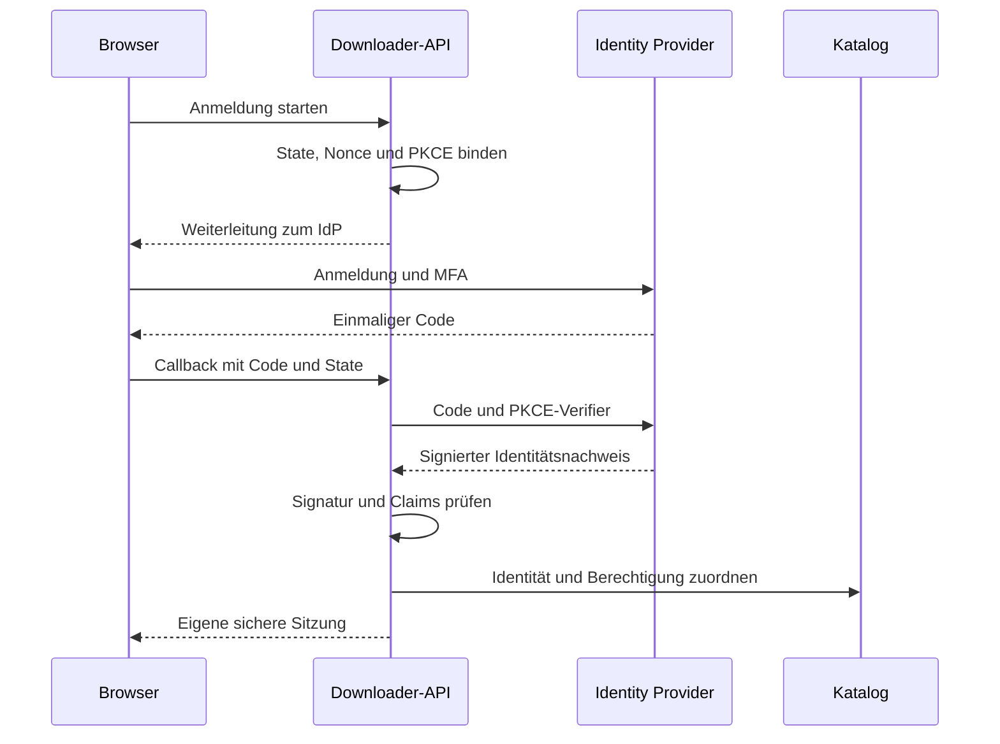

# 11 – Authentik, OpenID Connect und vereinfachte Benutzerverwaltung

## 1. Entscheidung

Externe Anmeldung wird **ab dem ersten nutzbaren Release** über OpenID Connect unterstützt. Authentik ist der erste Referenzanbieter; Keycloak dient als zweiter Vertragstest, damit die Integration nicht versehentlich Authentik-spezifisch wird. Andere standardkonforme Anbieter können nach Prüfung ihrer Fähigkeiten eingerichtet werden. **Die automatische Übernahme externer Kontosperren ist ab Version 2.1 dieses Plans verbindlicher Erstumfang.** Allgemeines OIDC deckt die Anmeldung ab; ein getrenntes Lifecycle-Protokoll deckt den aktuellen Kontostatus ab. Der fachliche Kern kennt keine Authentik-spezifischen Benutzerrechte.

Der Identity Provider (IdP) übernimmt die Anmeldung, Passwortregeln, MFA und Kontowiederherstellung. Die Anwendung bleibt für ihre Daten und Berechtigungen zuständig. Das spart eigene Kontoverwaltung bei SSO-Benutzern, ohne Benutzerbesitz oder History an ein bestimmtes Produkt zu koppeln.

| Betriebsmodus | Verwendung | Lokale Passwörter |
| --- | --- | --- |
| `oidc` | Empfohlen, wenn Authentik oder ein anderer IdP bereits vorhanden ist | Für normale SSO-Konten nicht vorhanden |
| `local` | Eigenständiger Betrieb ohne zusätzliche Identitätsinfrastruktur | Lokal mit Argon2id und MFA |
| `hybrid` | Kontrollierte Migration oder ausdrücklich erlaubte lokale Sonderkonten | Nur für einzeln freigegebene Konten; niemals automatischer Ausweichmodus |

Authentik muss nicht auf demselben Rechner laufen wie der Downloader. Linux, Windows und macOS bleiben Downloader-Zielsysteme; daraus folgt keine Pflicht, jeden IdP auf allen drei Systemen nativ mitzuinstallieren.

## 2. Zuständigkeitsgrenze

| Aufgabe | Im SSO-Modus zuständig |
| --- | --- |
| Passwort, MFA, Recoverycodes, externe Kontowiederherstellung | IdP |
| Anmeldung und Identitätsnachweis | IdP plus geprüfter OIDC-Client im Downloader |
| Stabile lokale Benutzer-ID und Eigentum an Medien/History | Downloader |
| IdP-Gruppen und Freigabe der Anwendung | IdP |
| Abbildung dieser Gruppen auf Anwendungsrollen | Downloader-Konfiguration |
| Lokale Sperre, Quoten, Adapter-/Speicherfreigaben | Downloader |
| Quellcookies und Immich-API-Keys | Verschlüsselter Secret-Store des Downloaders |
| Ergebnis-E-Mails und freiwilliges Opt-in | Downloader |
| Passwort-/MFA-E-Mails | IdP über dessen SMTP-Konfiguration |
| Automatische Anlage/Sperre ohne Login | Verbindliche Lifecycle-Anbindung im Downloader: SCIM und autoritativer Anbieterstatus, unabhängig vom Browserlogin |

Ein erfolgreicher SSO-Login ist weder ein Instagram-/Patreon-Zugang noch eine Immich-Zugriffsberechtigung. Es gibt keinen universellen gemeinsamen Token für diese Dienste.

## 3. Anbieter und Lizenzen

| Anbieter | Einordnung | Integrationsgrenze |
| --- | --- | --- |
| Authentik | Empfohlener Referenzanbieter; Kern überwiegend MIT, ausdrücklich gesonderte Lizenzbereiche | Native OIDC-Anbindung; Enterprise-Funktionen sind keine Voraussetzung dieser Basisplanung |
| Keycloak | Alternative mit Apache-2.0-Hauptlizenz | Zweiter OIDC- und Lifecycle-Vertragstest mit lesender Status-API; keine native SCIM-Funktion vorausgesetzt |
| Authelia | OIDC-Kandidat mit Apache-2.0-Hauptlizenz | Für vollständigen Projekteinsatz zusätzlich geeignete Lifecycle-Quelle nachweisen; OIDC allein genügt der Sperranforderung nicht |
| Weiterer OIDC-Anbieter | Standardschnittstelle | Discovery, Signaturen, Claims, MFA-Policy und Logout-Fähigkeiten vor Freigabe prüfen |

Authentiks Lizenzdatei grenzt unter anderem Dokumentation, Enterprise-Verzeichnis und Drittkomponenten vom MIT-Kern ab. [Authentik LICENSE](https://github.com/goauthentik/authentik/blob/main/LICENSE). Die Alternativen sind ebenfalls keine pauschal als MIT zu bezeichnenden Pakete: [Keycloak LICENSE](https://github.com/keycloak/keycloak/blob/main/LICENSE.txt), [Authelia LICENSE](https://github.com/authelia/authelia/blob/master/LICENSE).

Die eingesehene Authelia-Fähigkeitsmatrix weist die OIDC-Logout-Erweiterungen als nicht unterstützt aus. Deshalb ist dort zunächst lokales App-Logout mit begrenzter Sitzungslaufzeit vorgesehen, bis eine konkret getestete Version mehr nachweist. Quelle: [Authelia OIDC](https://www.authelia.com/integration/openid-connect/introduction/). Das ist ein sichtbarer Unterschied im Funktionsumfang. Eine Produktionsfreigabe für dieses Projekt setzt zusätzlich eine geprüfte automatische Sperranbindung voraus.

## 4. Anmeldeprotokoll

Die SPA bleibt auf der App-Origin; das Backend ist der vertrauliche OIDC-Client. Geplant ist Authorization Code mit PKCE S256. Die App verwendet die MIT-lizenzierte Bibliothek [openid-client](https://github.com/panva/openid-client). Tokens und Client-Secret gehören nicht in Browser-LocalStorage oder Frontendkonfiguration.



Protokollgrundlage: [OpenID Connect Core](https://openid.net/specs/openid-connect-core-1_0.html) und [OAuth Security BCP, RFC 9700](https://datatracker.ietf.org/doc/html/rfc9700). Darauf aufbauende Projektvorgaben:

- Provider administrativ festlegen; Discovery, Issuer und erlaubte Endpunkte binden. Keine dynamische Providerwahl anhand einer untrusted E-Mail-Domain.
- Exakte HTTPS-Callback-URL, keine Wildcards; Rücksprung innerhalb der App nur aus erlaubten relativen Pfaden.
- Einmaligen Loginvorgang serverseitig und an den initiierenden Browser binden; State, Nonce und PKCE prüfen. Zehn Minuten sind das vorgeschlagene Maximalfenster.
- Signatur mit erlaubtem Algorithmus und vertrauenswürdigem JWKS prüfen; `iss`, `aud`, gegebenenfalls `azp`, `exp`, `iat` und Nonce validieren. Schlüsselrotation unterstützen, unbekannte Schlüssel kontrolliert nachladen, niemals einfach akzeptieren.
- Nur erforderliche Scopes `openid profile email`; Gruppen als ausdrücklich konfigurierter Claim. Kein `offline_access` im Basisprofil.
- Access-Token nur kurzzeitig für erforderliches UserInfo verwenden; zurückgegebenes Subject mit dem ID-Token abgleichen. Keine Weitergabe an Immich oder Downloader.
- Eigene zufällige Sitzung erzeugen. Ein gegebenenfalls für Logout benötigtes ID-Token bleibt geschützt im Backend und wird nicht geloggt.

## 5. Stabile Benutzeridentitäten und Rollen

Die dauerhafte Zuordnung ist **`(issuer, sub) → users.id`**. `sub` wird nicht kleingeschrieben oder anderweitig normalisiert. Die lokale ID besitzt die Quellen und Medien. Eine E-Mail-Änderung ändert daran nichts. Gleichlautende Adressen in zwei Providern erzeugen keine automatische Kontenverschmelzung.

Für den ersten Login ist Just-in-Time-Anlage nur erlaubt, wenn der konfigurierte Zugriffsclaim passt und der Lifecycle-Connector eine eindeutige aktuelle Freigabe nachweist. Eine SCIM-Anlage kann vorher stattfinden; sie erlaubt ohne diese Prüfung keinen Zugriff. Vorschlag:

| IdP-Gruppe | Anwendung |
| --- | --- |
| `downloader-users` | Benutzerrolle und Loginfreigabe |
| `downloader-admins` | Adminrolle und Loginfreigabe; zusätzliche MFA-Vorgabe |
| Keine erlaubte Gruppe | Kein Login bzw. ausstehende explizite Freigabe |

Gruppennamen werden exakt verglichen, nicht als Teilstrings oder reguläre Ausdrücke. Der Claim muss eine begrenzte Liste von Strings sein; fehlende oder falsch typisierte Claims werden nicht zu einer großzügigeren Standardrolle. Die Anwendung wertet nur ihre eigenen Gruppennamen aus und archiviert nicht die komplette Organisationsmitgliedschaft.

Jedes Konto hat eine eindeutige Rechteherkunft: `local` oder ein festgelegter OIDC-Provider. Eine lokale Rolle und ein Gruppenclaim werden nicht unkontrolliert zusammenaddiert. Im OIDC-Modus ist die Rollenanzeige schreibgeschützt; eine lokale Sperre kann Zugriffe immer zusätzlich verbieten. Bei jeder erfolgreichen Anmeldung und jedem autoritativen Statusabgleich werden die zugehörigen Anwendungsrollen neu bewertet; ein Rollenentzug invalidiert bestehende Berechtigungsgenerationen. Ein fehlender oder unvollständiger Statusabruf bestätigt keine unveränderten Rechte. Privilegierte Änderungen verlangen frische Authentifizierung, vorgeschlagen höchstens fünf Minuten alt.

MFA wird über einen festgelegten, getesteten IdP-Flow erzwungen. Falls die App `acr`/`amr` auswertet, braucht jeder Provider eine konkrete vertrauenswürdige Zuordnung; die Strings sind nicht universell austauschbar. Keine pauschale Annahme „SSO bedeutet MFA“.

## 6. Konkrete Authentik-Einrichtung

Die folgenden Schritte sind eine Einrichtungsvorgabe für die spätere Anwendung, kein bereits ausgeführtes Setup. Menübezeichnungen und Felder werden mit dem ausgewählten Release abgeglichen.

1. In Authentik die Anwendungsgruppen anlegen und berechtigte Benutzer zuordnen.
2. Anwendung `Downloader Project` mit einem OAuth2/OpenID-Provider verbinden; vertraulichen Client wählen und ein asymmetrisches Signaturschlüsselpaar konfigurieren.
3. Authorization-Code-Flow und PKCE für diesen Client verwenden. Die exakte Callback-URL `https://downloads.example.com/api/v1/auth/oidc/authentik/callback` ausdrücklich eintragen, nicht automatisch aus dem ersten Aufruf übernehmen.
4. Zugriff auf die Anwendung an die vorgesehenen Gruppen binden. Einen MFA-Flow für den Produktionszugriff, mindestens für Admins, festlegen.
5. Scopes/Property-Mapping so konfigurieren, dass nur benötigte Identitätsfelder und ein Claim `downloader_groups` mit den App-Gruppen ausgegeben werden.
6. Issuer und Discovery-URL aus der Providerkonfiguration übernehmen. Gewählten Subject-/Issuer-Modus danach nicht ohne Identitätsmigration ändern.
7. Client-ID und Secret im Downloader hinterlegen; Secret serverseitig verschlüsselt speichern. Erst nach einem Testlogin aktivieren.
8. Einen SCIM-Backchannel zur festen Downloader-Basis `https://downloads.example.com/scim/v2/authentik` mit eigenem Token einrichten; Zuordnung von `active`, App-Gruppen und stabiler `externalId` explizit testen. Der OIDC-Subjectmodus und das SCIM-Mapping müssen dieselbe kontrollierte Identität abbilden. E-Mail-Matching bleibt ausgeschaltet.
9. Separaten lesenden Status-Connector einrichten. Das Backend ordnet verifizierte OIDC-/SCIM-IDs eindeutig der internen Anbieter-ID zu. Ein festes administratives Mapping oder ein nur vom IdP gesetzter, signierter Identitätsclaim kann diese Zuordnung liefern. Freie Benutzerprofilfelder dürfen sie nicht verändern.
10. Konto deaktivieren, Gruppenrecht entziehen, Meldung verlieren lassen und Providerverbindung unterbrechen; Sperrung, Frischegrenze und Job-Stopp praktisch prüfen. Erst dann das verwaltete SSO-Profil produktiv aktivieren.
11. Unterstütztes Back-Channel-Logout zur Downloader-URL konfigurieren und testen; diese zusätzliche Sitzungsfunktion ersetzt die Pflicht-Sperrsynchronisation nicht.

Authentik dokumentiert OIDC, PKCE und anwendungsspezifische Issuer sowie Claim-Mappings. Sein dokumentierter E-Mail-Verifikationsdefault ist versionsabhängig; deshalb niemals pauschal `email_verified=true` setzen. Für den Mailversand ist eine echte Verifikation oder eine separat bestätigte App-Adresse erforderlich. Quellen: [OAuth2 Provider](https://docs.goauthentik.io/add-secure-apps/providers/oauth2/), [Provider anlegen](https://docs.goauthentik.io/add-secure-apps/providers/oauth2/create-oauth2-provider/).

Vorgeschlagener **eigener Konfigurationsvertrag**, noch keine lauffähige Produktdatei:

```yaml
auth:
  mode: oidc
  allowEmailAutoLink: false
  sessionAbsoluteMinutes: 60
  privilegedAuthMaxAgeSeconds: 300
  providers:
    - id: authentik
      enabled: false  # Aktivierung nach Test
      issuer: https://auth.example.com/application/o/downloader/
      clientId: downloader-client
      clientSecretRef: secret://oidc/authentik
      redirectUri: https://downloads.example.com/api/v1/auth/oidc/authentik/callback
      scopes: [openid, profile, email]
      pkce: S256
      groupClaim: downloader_groups
      allowedGroups: [downloader-users, downloader-admins]
      adminGroups: [downloader-admins]
      provisionOnFirstLogin: true
      lifecycleMode: managed
      lifecycle:
        push: scim2
        scimBaseUrl: https://downloads.example.com/scim/v2/authentik
        scimCredentialRef: secret://scim/authentik
        statusConnector: authentik
        statusCredentialRef: secret://lifecycle/authentik
        pollIntervalSeconds: 60
        staleAfterSeconds: 120
        failClosed: true
      backchannelLogout: capability_test_required
```

`secret://` ist hier ein Platzhalter für den eigenen Secret-Store. Es werden keine echten Schlüssel oder fertigen Fremdsystemkonfigurationen mitgeliefert.

## 7. Logout, Kontosperre und Statusfrische

| Vorgang | Wirkung |
| --- | --- |
| In der App abmelden | Eigene Browsersitzung widerrufen; autorisierte Zeitpläne laufen weiter |
| OIDC-Logout / Back-Channel-Logout | Betroffene Sitzungen beenden; keine automatische Kontolöschung |
| Lokales Konto sperren | Sofortige lokale Zugriffssperre; Sitzungen widerrufen, neue Jobs/Cleanup stoppen |
| Konto in Authentik oder einem freigegebenen Anbieter sperren | Automatische Übernahme derselben Wirkung über SCIM/Status-Connector; kein erneuter Login erforderlich |
| Externer Status veraltet oder unbekannt | Effektive Freigabe aussetzen, bis ein autoritativer Abgleich erfolgreich ist |
| Externes Konto wieder freigeben | Frischen Status prüfen; lokale Sperre bleibt maßgeblich, alte Sitzungen/Cleanup-Freigaben bleiben ungültig |

Die Sperrsynchronisation läuft unabhängig vom Downloadpool. Sie setzt Status, erhöhte `authz_generation`, Sitzungswiderruf und Job-Stopp-Outbox transaktional. Jeder API-Aufruf und jeder Workerstart prüft die effektive Berechtigung. Aktive Medienstreams und SSE-Verbindungen werden beendet; Fetch-/Transfer-Worker stoppen kooperativ, danach nötigenfalls mit begrenztem Prozessabbruch. Unvollständiges Staging bleibt unsichtbar. Laufende Datenbanklöschung prüft vor jedem Batch; eine bereits vorher abgeschlossene atomare Dateientfernung kann nicht rückgängig gemacht werden.

### Messbare Zeitvorgaben des Projekts

- Ein akzeptiertes Deaktivierungsereignis muss innerhalb von höchstens 5 Sekunden wirksam in der zentralen Autorisierung sein. Das ist eine interne Abnahmevorgabe.
- Autoritative Prüfung aller verwalteten Konten spätestens alle 60 Sekunden; Zielsystem und API-Budgets müssen dafür bis zu 100 Konten einschließlich Pagination tragen. Polls dürfen durch Downloadlast nicht verhungern.
- Höchstens 120 Sekunden zwischen der letzten bestätigten Freigabe und dem Ende ihrer Gültigkeit. Bei überschrittener Frist, unbekanntem Status, Authfehler oder unvollständigem Abgleich gilt automatisch `IDENTITY_STATUS_STALE`. Ein erreichbarer Server oder irgendein SCIM-Request verlängert keine kontospezifische Freigabe.
- Im verbundenen Abnahmesystem muss eine IdP-Sperre innerhalb von 120 Sekunden den Appzugriff und neue Arbeit blockieren. Aktive Runner werden danach spätestens binnen 30 Sekunden kontrolliert gestoppt. Diese Fristen sind nachzuweisende Produktziele, keine zugesagte Echtzeitleistung eines fremden Dienstes.
- Diese Werte dürfen enger konfiguriert werden. Eine Lockerung verändert das dokumentierte Sicherheitsprofil und benötigt erneute Abnahme; sie ist kein beliebiges Download-Limit.

Eine kontinuierlich gesunde Statusprüfung darf Rollen und Freigabe aktualisieren, aber keine bereits verarbeitete Sperre durch eine ältere Antwort rückgängig machen. Mehr dazu in Abschnitt 8. Ohne belastbare Frischequelle wird das verwaltete Produktionsprofil nicht aktiviert. Manueller zweiter Sperrschritt ist nur ein Notfallwerkzeug, keine reguläre Voraussetzung.

Back-Channel-Logout bleibt eine zusätzliche geprüfte Fähigkeit. Signatur, Issuer, Audience, Zeitbezug, Ereignistyp, `jti` und `sid` bzw. `sub` werden validiert; Replay ist idempotent. Ein Logout-Token ist kein normales ID-Token und keine Deprovisionierungsnachricht. Quellen: [OIDC Back-Channel Logout](https://openid.net/specs/openid-connect-backchannel-1_0.html), [Authentik Logout](https://docs.goauthentik.io/add-secure-apps/providers/oauth2/frontchannel_and_backchannel_logout/). Eine vom Anbieter als Preview markierte Funktion wird nicht zur einzigen Sperrgrundlage.

App-Sitzungen bleiben auf höchstens 60 Minuten begrenzt, Admin-Step-up auf fünf Minuten; die kürzere Lifecycle-Frischegrenze gilt zusätzlich. Optionales globales IdP-Logout wird gesondert angezeigt und gegen [RP-Initiated Logout](https://openid.net/specs/openid-connect-rpinitiated-1_0.html) getestet.

## 8. Anbieterunabhängiger Lifecycle-Vertrag

Der Kern verarbeitet `identity`, `active`, `appAssigned`, relevante Rollen/Gruppen, Prüfzeit, Provider-Generation und eine belegte Korrelation. Anbieteradapter liefern diesen normalisierten Status; HTTP-/SCIM-Besonderheiten gelangen nicht in Medien- oder Joblogik.

| Anbieterprofil | Schneller Änderungsweg | Autoritativer Abgleich |
| --- | --- | --- |
| Authentik | SCIM 2.0 mit eigenem Token | Lesende Benutzer-/Gruppenstatus-API über dedizierten Connector |
| Keycloak | Optional später ein getesteter Ereignisweg | Lesende Admin-REST-Schnittstelle für Kontostatus und konfigurierte App-Gruppen |
| Anderer OIDC-Anbieter | SCIM oder authentifizierte providerbezogene Ereignisse, soweit vorhanden | Getesteter Status-Connector oder vollständiges, aktuelles Lifecycle-Snapshot-Protokoll |

Authentik dokumentiert SCIM-Änderungsübertragung und einen stündlichen Vollabgleich. Das allein reicht nicht für das hier festgelegte kurze Ausfallfenster; deshalb kommt der eigene Statusabgleich hinzu. Die Standardanbindung verwendet den statischen SCIM-Token über TLS, keine verpflichtende Enterprise-Funktion. Quelle: [Authentik SCIM](https://docs.goauthentik.io/add-secure-apps/providers/scim/).

Die offiziellen [Authentik-Benutzerendpunkte](https://api.goauthentik.io/reference/core-users-retrieve/) und [Keycloak-Admin-REST-Endpunkte](https://www.keycloak.org/docs-api/latest/rest-api/index.html) bilden die Basis der lesenden Connectoren. Genaue Felder, Pagination und minimale Leserechte werden gegen das ausgewählte Release getestet. Erster unterstützter Berechtigungsvertrag: aktives Konto und explizite App-Gruppen. Komplexe zusätzliche IdP-Zugriffspolicies benötigen ebenfalls einen autoritativen Nachweis, bevor sie als automatisch synchronisiert beworben werden.

### SCIM-Verhalten und Identität

- `Users` und `Groups` werden über den in 07 festgelegten SCIM-Teilumfang verwaltet. Provisionierungs-Credentials dürfen keine Medien, Quellcookies oder Immich-Secrets lesen.
- `active=false`, bestätigte Nichtzuweisung und DELETE bewirken Deaktivierung. DELETE entfernt keine fachliche History oder Nutzdaten; die SCIM-Ressource wird als deprovisioniert behandelt, während eine minimale interne Zuordnung für Wiederanlauf/Migration erhalten bleibt.
- `(issuer, sub)` bleibt der Loginidentitätsschlüssel. SCIM-`externalId`, SCIM-Ressourcen-ID und interne IdP-ID werden ausdrücklich zugeordnet. Eine Übereinstimmung darf aus einem getesteten Providermapping stammen, niemals aus bloß gleicher E-Mail.
- Normale Änderungen sind idempotent und providergebunden. Request-/Versionsinformationen werden begrenzt protokolliert. Bei unvollständiger Pagination darf kein Konto aus einem bloßen Fehlen in einer Teilseite als gelöscht gelten; statt dessen bleibt der Status unbestätigt.
- Eine Sperrmeldung wirkt sofort. Ein anschließendes `active=true` oder eine ältere parallele Pollantwort darf sie nicht ungeprüft aufheben. Wiederfreigabe verlangt eine neu gestartete autoritative Prüfung nach der Sperrgeneration. Lokale Adminsperren überstimmen externe Freigaben weiterhin.
- Ein erfolgreicher Login ersetzt keinen Lifecycle-Abgleich. Ein ausgeschiedener Benutzer kann sich nicht durch vorhandene Cookies, ein spät eintreffendes Event oder einen zweiten Login reaktivieren.
- Reconciliation misst Vollständigkeit, Latenz und Statusfrische; `verified_at` wird nur aus tatsächlicher autoritativer Prüfung aktualisiert. Fehlende Pushmeldungen allein beweisen keinen gesunden Zustand.

Grundlage: [SCIM RFC 7644](https://www.rfc-editor.org/rfc/rfc7644.html). Für andere Provider ist der generische Vertrag wiederverwendbar. Kann ein Anbieter nur OIDC-Anmeldung liefern, ist diese Fähigkeit nutzbar, erfüllt aber noch nicht die komplette Produktionsanforderung F21. Die Oberfläche kennzeichnet das und verhindert eine irreführende Freigabe.

## 9. Migration und Notfallzugang

Lokales Konto → SSO: lokal frisch anmelden, externe Identität frisch authentifizieren, eindeutige Verknüpfung bestätigen und auditieren. Die `users.id` und sämtliche Eigentümerbezüge bleiben unverändert. Lokales Passwort danach nach bewusster Policy deaktivieren; kein verdeckter zweiter Zugang.

IdP-Wechsel: alte und neue Identität kontrolliert derselben lokalen ID zuordnen, Dubletten/Konflikte prüfen, neue Anmeldung testen, alte Identität deaktivieren und alle betroffenen Sitzungen beenden. Ein Issuerwechsel nach Restore darf nicht durch automatisches E-Mail-Matching „repariert“ werden.

Bei IdP-Ausfall werden neue OIDC-Anmeldungen abgelehnt. Gültige App-Sitzungen bleiben nur innerhalb ihrer festgelegten Laufzeit nutzbar; frische Step-up-Aktionen scheitern geschlossen. Bereits autorisierte Jobs dürfen nur bis zum Ablauf der verbindlichen Lifecycle-Frischegrenze weiterlaufen; danach werden sie kontrolliert angehalten. Reine Browserabmeldung bei gesundem Kontostatus stoppt dagegen keine Zeitpläne. Ein lokaler Notfallzugang wird ausschließlich durch den Hostbetreiber zeitlich begrenzt aktiviert, protokolliert und anschließend wieder deaktiviert; keine automatische öffentliche Passwort-Hintertür.

## 10. Abnahme

Authentik und Keycloak gegen konkrete Versionen testen: OIDC-Code/PKCE, Claims/MFA, Identitätskollision, unbekannte Schlüssel, Providerwechsel, Rollenentzug, lokale und externe Sperre, Konto-Neufreigabe und Netzwerkausfall. Authentik-SCIM-Verträge enthalten zudem Mapping, PUT/PATCH/DELETE, Wiederholungen und verlorene Ereignisse.

T29–T40 und T42–T46 in [08](08_Umsetzungsplan_und_Abnahme.md) sind Pflichtgates. Sperrung wird bei offenen Browsersitzungen, laufenden Jobs, Cleanup-Karenz und hoher Downloadlast geprüft. Die erste SSO-Produktivfreigabe darf nicht auf ein späteres Lifecycle-Ausbaupaket verweisen.

